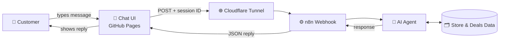

<div align="center">


[](https://git.io/typing-svg)


### [🚀 **Live Demo**](https://adarsh705875.github.io/patel-brothers-whatsapp-demo/)

</div>

> ⚠️ **Disclaimer:** This is an independent learning prototype. It is **not affiliated with, endorsed by, or an official product of Patel Brothers or WhatsApp.** Store and deal data used in the demo is for demonstration only.

---

## 📸 Preview

<!-- Replace with your own screenshot or GIF: upload it to the repo and use the path below -->
<!--  -->

*Add a screenshot or GIF of the chat here.*

---

## 📖 Overview

An interactive **WhatsApp-style customer support web app** connected to an **n8n automation workflow** and an **AI agent**. It shows how a grocery retailer could handle repetitive customer questions (store locations, opening hours, weekly deals and ordering) through a familiar chat interface instead of a human replying to every message.

**Try asking:**

- "Hi"
- "Where is the nearest Patel Brothers store?"
- "What are your store timings?"
- "Show me this week's deals."
- "I want to place a grocery order."
- "Can I speak to a human representative?"

---

## ✨ Features

| | Feature | Details |
|---|---|---|
| 💬 | **WhatsApp-style chat UI** | Message bubbles, input box, send action, and a persistent session ID stored in the browser |
| 🤖 | **AI-powered replies** | Messages are processed by an AI agent connected to a configured language model |
| ⚙️ | **n8n orchestration** | A webhook receives each message and returns the AI response to the page |
| 📍 | **Store information** | Answers about locations, addresses, contact numbers and hours |
| 🏷️ | **Weekly deals** | Structured promotional data for deal-related questions |
| 🛒 | **Guided ordering** | Demonstrates a conversational grocery ordering flow |
| 🙋 | **Human handoff** | Recognizes requests to speak with a person |

---

## 🏗️ System Architecture



**Flow in short:** the frontend sends the message and session ID to an n8n webhook, the AI agent builds a reply using the configured instructions and business data, and n8n returns it to the chat window. The UI and the AI logic are separate, so the backend can change without rebuilding the frontend.

---

## 🧰 Tech Stack

| Layer | Technology |
|---|---|
| Frontend | HTML, CSS, JavaScript |
| Automation | n8n (webhook workflow) |
| AI | AI agent with a configured language model |
| Data | Structured store and deals records |
| Hosting | GitHub Pages (frontend), Cloudflare Tunnel (exposes n8n for demo) |

---

## 📁 Project Structure

```
patel-brothers-whatsapp-demo/
├── index.html      # Chat interface and webhook communication
└── README.md
```

---

## 🚀 Getting Started

### Run the frontend locally

```bash
git clone https://github.com/Adarsh705875/patel-brothers-whatsapp-demo.git
cd patel-brothers-whatsapp-demo
```

Open `index.html` in your browser, or serve it with any static server:

```bash
python -m http.server 8000
```

### Connect your own n8n backend

1. Install and start **n8n** (locally or on a server).
2. Create a workflow with a **Webhook** node (POST) that receives the customer's message and session ID.
3. Connect the webhook to an **AI Agent** node with your chosen language model, a system prompt and your store and deals data.
4. Return the agent's answer with a **Respond to Webhook** node.
5. Expose n8n for the demo, for example with a Cloudflare Tunnel:
```bash
   cloudflared tunnel --url http://localhost:5678
```
6. Put your webhook URL in `index.html` where the `fetch` call is made.
7. Activate the workflow and send a test message.

> 🔐 **Never commit API keys or credentials.** Keep model keys inside n8n credentials, not in `index.html`.

### Deploy on GitHub Pages

**Settings → Pages → Deploy from a branch → `main` / root.** Your site will be live at `https://adarsh705875.github.io/patel-brothers-whatsapp-demo/`.

---

## 🧪 Testing

Try these in the chat and check that each gets a sensible reply:

| Test message | Expected behavior |
|---|---|
| "Hi" | Friendly greeting |
| "Nearest store?" | Store location details |
| "What are your timings?" | Opening hours |
| "Show me this week's deals" | Current deals |
| "I want to order groceries" | Guided ordering prompts |
| "Talk to a human" | Handoff response |

---

## ⚠️ Limitations

- This is a **prototype**, not a production customer service system.
- The live demo only responds while the **n8n backend and tunnel are running**. Free Cloudflare quick tunnels also change their URL on restart, so the webhook URL may need updating.
- Answer quality depends on the model, system instructions and the data supplied.
- The chat UI only imitates WhatsApp. It does **not** use the official WhatsApp API.
- Data shown is sample data.

---

## 🔮 Future Enhancements

- [ ] Real WhatsApp Business API integration
- [ ] Connect to a live product and inventory database
- [ ] Order confirmation and payment flow
- [ ] Handoff to a real support agent
- [ ] Multi-language support
- [ ] Chat history and analytics dashboard
- [ ] Permanent hosted backend instead of a tunnel

---

## 🎓 What I Learned

- Building a chat interface with JavaScript and webhook communication
- Designing automation workflows in n8n
- Connecting an AI agent to structured business data
- Exposing a local service safely for demos
- Handling sessions, errors and real-world limits of AI replies

---

## 👤 Author

**Adarsh Kadam**: Game Developer · AI/ML Engineer · Data Analyst

[](https://linkedin.com/in/adarsh-kadam)
[](https://github.com/Adarsh705875)
[](mailto:adarshkadam06@gmail.com)

<div align="center">

⭐ If you found this useful, consider starring the repo!


</div>
